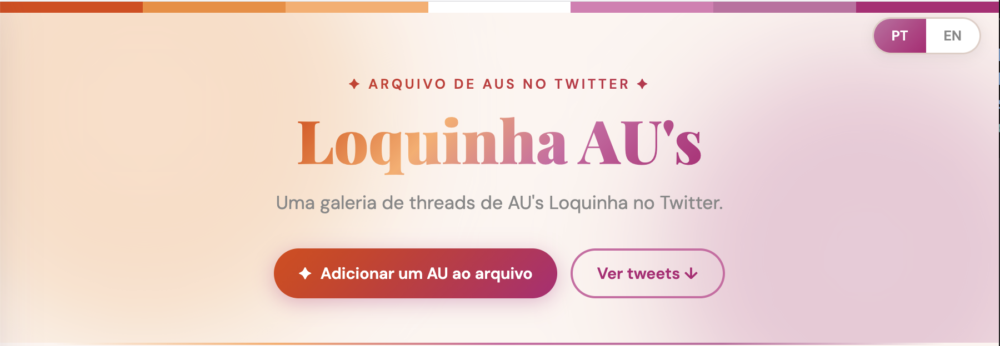

[](https://loquinhaau.github.io)

Live site: <https://loquinhaau.github.io>

# Loquinha AU's gallery website source code

A small static page that turns a manually curated list of Twitter / X "AU" threads into a searchable, filterable, embeddable gallery. Built originally for the **Loquinha** ship by [@slappepolsen](https://twitter.com/slappepolsen).

---

## Reuse & credit

You're free to copy, fork, modify, and host this code **for any other ship or fandom**, on one condition:

> **Credit `@slappepolsen` somewhere on your page** (a footer line is enough), and link back to the original repo.

A short credit line you can paste is at the bottom of this README.

That's the whole license. If you build something cute with it, I'd love to see it, feel free to tag me on Twitter / X.

---

## What you actually need to change to re-skin this for another ship

The whole site is **a single `index.html` file**. To turn this into "MyShip AU's" you only have to do two things:

1. **Collect the tweet URLs of the AU threads you want to feature.**
2. **Paste them into the `TWEETS` list** inside `index.html`.

Everything else such as the title, hero text, colors, language strings is just text in the same file. You can put a working clone up on the web in an afternoon.

---

### Step 1 — Get the source

Just download the `index.html` file.

Open `index.html` in your browser by double-clicking it. This is enough to preview your changes locally.

---

### Step 2 — Collect tweet URLs manually

To gather URLs for your ship:

- Search Twitter / X for `"au" "yourship"` (the same query I use for Loquinha).
- Scroll the algorithm's suggestions on your ship's hashtag.
- Ask the fandom for input an recommendations.

For each AU thread you want to include, **copy the tweet URL of the first tweet of the thread**. Both formats work and are equivalent:

- `https://twitter.com/medveguillen/status/2015595707491598362`
- `https://x.com/medveguillen/status/2015595707491598362`

> **Tip: the author handle is already in the URL.** In the example above, the handle is `medveguillen`: it's the part between `twitter.com/` (or `x.com/`) and `/status/`. You'll need it in the next step.

---

### Step 3 — Paste them into `TWEETS`

Open `index.html` and look for the line that starts with:

```js
const TWEETS = dedupeTweets([
```

Below it you'll see one entry per AU, like:

```js
{
  "id": 1,
  "author": "medveguillen",
  "url": "https://twitter.com/medveguillen/status/2015595707491598362",
  "metaTags": [ "Editor's pick" ],
  "tags": [ "Enemies/Rivals to Lovers", "Fake Dating", "Pining" ]
},
```

Replace the existing entries with your own. The minimum required for a working entry is **three fields**:

| Field    | Required? | What to put                                                              |
| -------- | --------- | ------------------------------------------------------------------------ |
| `id`     | Yes       | Any unique integer (just count up: `1, 2, 3, …`).                        |
| `author` | Yes       | The handle from the URL, **without the `@`**, e.g. `"medveguillen"`.     |
| `url`    | Yes       | The full tweet URL (twitter.com or x.com, both fine).                    |
| `tags`   | Optional  | An array of trope strings. Leave it out entirely if you don't want any.  |
| `metaTags` | Optional | Special badges — see [Special meta tags](#special-meta-tags) below.    |

**Bare-minimum entry:**

```js
{
  "id": 1,
  "author": "medveguillen",
  "url": "https://twitter.com/medveguillen/status/2015595707491598362"
},
```

That's it. The site will render it, embed the tweet, and let people add it to their reading list. **You don't have to add tags.** If you do nothing else, you already have a working archive.

---

### Step 4 — (Optional) add trope tags

Tags are how visitors filter the gallery ("show me only Fake Dating + Slow Burn"). They're free-form strings in the sense thatL whatever you write is what people see and what they can filter by.

```js
"tags": [ "Fake Dating", "Slow Burn", "Coffee Shop AU" ]
```

A few rules of thumb:

- Be consistent with capitalization and wording (`"Fake Dating"` and `"fake-dating"` will be treated as two different filters).
- Reuse the same tag across multiple AUs whenever possible — that's what makes filtering useful.
- You can invent new tags any time. The filter list is built automatically from whatever you wrote.

You can copy the tag vocabulary from the existing entries as a starter, or invent your own.

---

### Step 5 — (Optional) re-brand the page

These are the obvious "Loquinha" strings to swap. All of them are inside `index.html`; just search for them:

| What to change                                | Where to find it                                                  |
| --------------------------------------------- | ----------------------------------------------------------------- |
| Page title in the browser tab                 | `<title>Loquinha AU's …</title>` and the `pageTitle` strings.     |
| Big headline at the top                       | `<h1><span class="gradient-text">Loquinha AU's</span></h1>`.      |
| Hero subtitle                                 | The `heroSub` strings inside the `MESSAGES` object.               |
| All other text (PT-BR + EN)                   | The `MESSAGES` object near the top of the `<script>` block.       |
| Footer / about / "tweet me" link              | Search for `slappepolsen` and replace **only** the ones that point to *your* contact info — but **leave a credit line** (see below).
| Colors / gradient                             | The CSS variables at the top of the `<style>` block (`--accent`, etc.). |
| GitHub repo link                              | The "source code" link card in the about section.                 |

If your audience isn't Portuguese-speaking, you can also just delete the PT branch from `MESSAGES` and the language-toggle markup; only the `en` block is strictly required.

---

### Step 6 — Host it

It's a single static file. Anywhere works:

- **GitHub Pages** — push to `username.github.io` or enable Pages on a repo. Free.
- **Netlify / Cloudflare Pages** — drag-and-drop the folder. Free. The included `_redirects` file is for Netlify-style hosts.
- **Your own server** — copy `index.html` to any web root.

No build step. No `npm install`. The page works straight from disk.

---

## Special meta tags

Inside a tweet's `metaTags` (note the capital T), three values get rendered as **badges** instead of regular filterable trope tags. You can use any combination of them, or none:

| Value                | Effect                                                                       |
| -------------------- | ---------------------------------------------------------------------------- |
| `"Editor's pick"`    | Pink "Editor's pick" badge; pinned to the top of the gallery.                |
| `"mini AU"`          | Small "mini AU" badge for short threads.                                     |
| `"not started (yet)"`| "Not started yet" badge for AUs that have been teased but not posted.        |

Anything else you put in `metaTags` will be shown as a plain badge.

---

## Tweet object cheatsheet

```js
{
  "id": 42,                                         // unique integer, required
  "author": "someuser",                             // X/Twitter handle, no @, required
  "url": "https://x.com/someuser/status/123…",      // full tweet URL, required
  "metaTags": [ "Editor's pick" ],                  // optional, see table above
  "tags": [ "Fake Dating", "Slow Burn" ]            // optional, free-form strings
},
```

---

## Credit blurb to paste

If you reuse this code, include something like this in your footer or about section:

```
Source code based on the Loquinha AU's archive by @slappepolsen https://github.com/loquinhaAU/loquinhaAU.github.io
```

Have fun, and have a beautiful gallery. 🧡🩷
